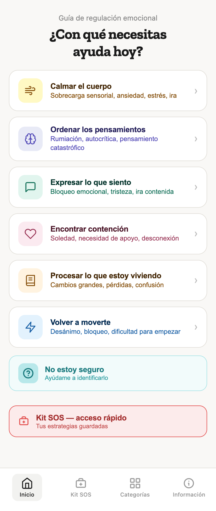
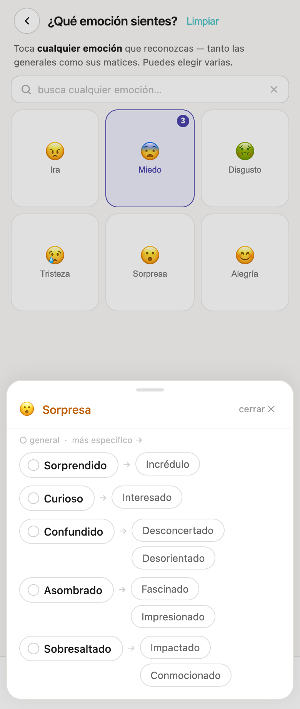
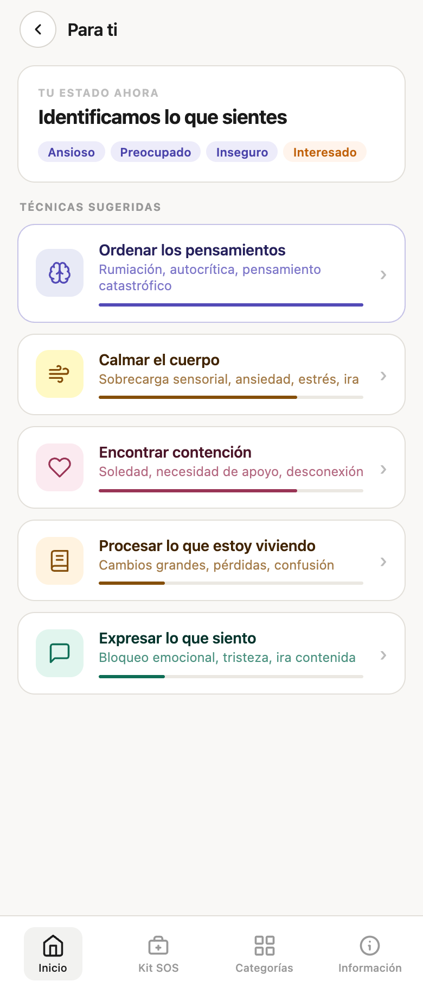
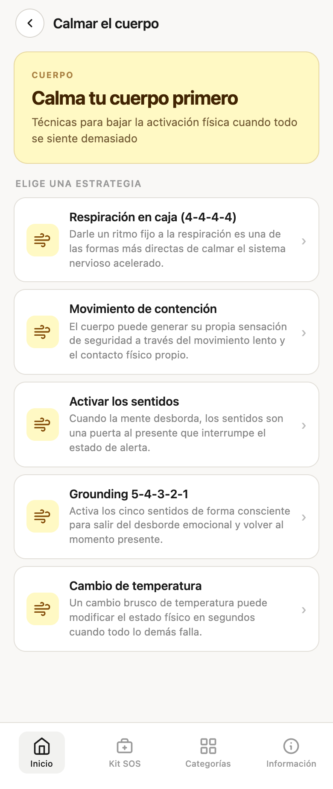
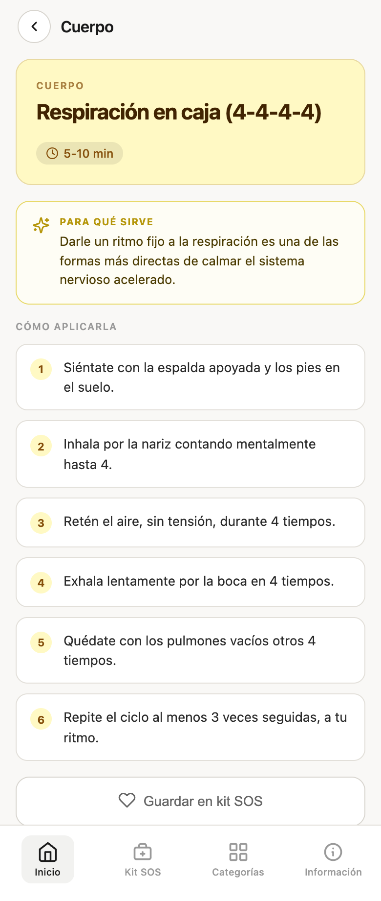
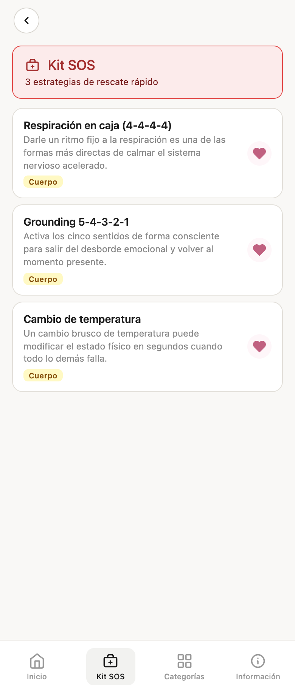

# Regulación emocional ❤️‍🩹 

Guía interactiva para identificar lo que sientes y encontrar estrategias para regularte, paso a paso.

🔗 [Probar la app](https://malefice-design.github.io/regulacion-emocional/)

## Qué hace

- Parte de una pregunta simple: **¿con qué necesitas ayuda hoy?** Puedes elegir entre calmar el cuerpo, ordenar los pensamientos, expresar lo que sientes, encontrar contención, procesar lo que estás viviendo o volver a moverte.
- Si no sabes qué te pasa, te ayuda a identificarlo eligiendo una o varias emociones.
- Te sugiere técnicas y te explica cómo aplicarlas.
- Incluye un **Kit SOS** de acceso rápido y te deja guardar tus estrategias.
- Se puede instalar en el celular como app (PWA).

## Sobre el proyecto

Proyecto personal y sin fines de lucro, diseñado por [Magdalena Riquelme](https://malefice.cl).

## Pantallas

| Inicio | Selector de emoción | Resultado |
|:---:|:---:|:---:|
|  |  |  |

| Estrategias | Cómo aplicarla | Kit SOS |
|:---:|:---:|:---:|
|  |  |  |

## Desarrollo local

HTML, CSS y JavaScript sin build step:

```bash
npx serve .
```
